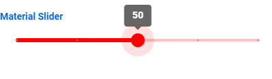

# What is this?

[Material slider](https://github.com/material-components/material-components-web/tree/master/packages/mdc-slider
) wrapper as a Vaadin component. Does not have full functionality, you are welcome to extend it.


# How to use it?

Instructions found in Vaadin directory: [Component link](https://vaadin.com/directory/component/paper-slider)

# Available commands:

```
PaperSlider slider = new PaperSlider(100); //current slider value
slider.setLabel("Material Slider");
slider.showValues(); //is default. Use .hideValues() to hide the values
slider.setMax(100); //100 is default
slider.setMin(0); //0 is default
slider.setStep(25); //Can be set
slider.setValue(0); //changes current value
slider.setPrimaryColor("red"); //Theming of the slider
slider.addValueChangeListener(event -> Notification.show("Value: " + event.getValue()));
slider.setDisabled(false);
```

# Preview:


# How to build

You can create the zip package needed for [Vaadin Directory](https://vaadin.com/directory/) using
```
mvn install -Pdirectory
```